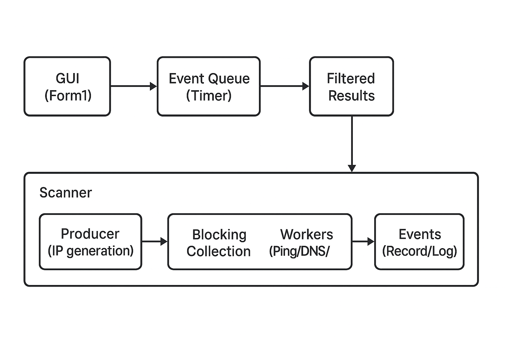

# Paralelní LAN Scanner

- Autor: Dominik Pour
- Kontakt: domcapour1@gmail.com
- Škola: SPŠE Ječná
- Datum vypracování: 2025‑11‑24
- Projektový status: školní projekt
- Verze: Initial.

## Požadavky a Use Case

- Business requirements:
  - Uživatel chce skenovat velké rozsahy IPv4 adres bez zamrzání UI.
  - Během skenu chce vidět průběžné výsledky a log.
  - Chce filtrovat výsledky, řadit je a exportovat do CSV/JSON/XML.
  - Chce konfigurovat počet workerů, DNS lookup a port scan.
- Functional requirements:
  - Zadání `Start IP` a `End IP` v GUI.
  - Nastavení `Workery`.
  - Producent–konsument architektura s `BlockingCollection<IPAddress>`.
  - `Ping`, volitelný `DNS lookup`, volitelný TCP port scan.
  - Tabulka s průběžnými výsledky, numerické řazení IP a RTT.
  - Živý log s časem a ID workeru.
  - Export do CSV/JSON/XML s aplikovanými filtry, blokace exportu při prázdné tabulce.
  - UI aktualizace přes `Invoke()/BeginInvoke()` a batchování přes `Timer`.
- Use Case :
  - UC‑1 Spustit sken: Uživatel zadá rozsah a parametry, klikne `Start`, průběžně sleduje výsledky.
  - UC‑2 Zastavit sken: Klikne `Stop`, běh se přeruší, UI zůstane stabilní.
  - UC‑3 Filtrovat: Uživatel nastaví filtry.
  - UC‑4 Exportovat: Uživatel exportuje aktuálně zobrazené výsledky do CSV/JSON/XML.
  - UC‑5 Řadit: Klik na hlavičku sloupce řadí IP numericky, RTT číselně.

## Architektura

- Složky:
  - `Models/ScanRecord.cs` – datový model výsledku.
  - `Services/Scanner.cs` – producent–konsument skener, eventy `Record`, `Log`, `Completed`.
  - `Utils/IpUtils.cs` – pomocné IP utility: `TryParseIPv4`, `FromUInt32`, `IpToUInt32`, `ParsePorts`.
  - `Form1.cs`, `Form1.Designer.cs` – UI, filtr, řazení, export, virtual list.
- Vzory:
  - Producer–Consumer: `BlockingCollection` + `Task.Run`.
  - Observer: eventy `Record`, `Log`, `Completed` v `Scanner`.
  - UI Virtualization: `ListView.VirtualMode` a `RetrieveVirtualItem`.
  - Cancellation: `CancellationTokenSource` v `Scanner.Stop()`.
  ---

  

  ---
## Behavior

- Activity flow:
  1. Start → Validace IP → Nastavení workerů → Spuštění Scanner → Generování IP → Konzumenti z fronty.
  2. Pro IP: Ping → (DNS) → (Port scan) → Emitovat `Record` + `Log`.
  3. Form batchuje eventy (Timer) → aktualizuje `filteredResults` → invaliduje `VirtualListSize`.
  4. Stop → `CancellationTokenSource.Cancel()` → `Completed` → UI Timer stop.

## Rozhraní, protokoly a závislosti

- Rozhraní/protokoly:
  - ICMP Ping (`System.Net.NetworkInformation.Ping`).
  - DNS (`System.Net.Dns.GetHostEntryAsync`).
  - TCP connect (`System.Net.Sockets.TcpClient`).
- Závislosti:
  - .NET 9, Windows Forms.
  - Testy: NUnit, NUnit3TestAdapter, Microsoft.NET.Test.Sdk.
- Nefunkční požadavky:
  - Stabilita UI, nízká paměťová náročnost (virtual list, lazy generation, bounded queue).
  - Paralelismus řízený `SemaphoreSlim`.

## Konfigurace programu

- GUI volby:
  - `Start IP`, `End IP` – rozsah IPv4.
  - `Workery` – počet souběžných konzumentů.
  - `DNS lookup` – zapnout/vypnout.
  - `Scan portů` – seznam portů (`80,443,22`).
  - Filtry: `Stav`, `IP filtr`, `Hostname filtr`, `RTT min/max`.

## Instalace a spuštění

- Požadavky: `dotnet 9.0.101`, Windows.
- Build: `dotnet build` v kořeni projektu.
- Spuštění: `dotnet run` nebo z Visual Studio.
- Testy: `dotnet test tests\PortScanner.Tests\PortScanner.Tests.csproj`.

## Chybové stavy a řešení

- Neplatný rozsah IP: zobrazí se log „Neplatný rozsah“, sken se neprovede.
- Timeout ping: stav `Timeout`, bez RTT.
- DNS výjimky: zachyceny, hostname prázdný.
- Port scan connect timeout: port je považován za zavřený.
- Export při prázdné tabulce: blokováno, informativní message box.
- UI interakce během skenu: batchování přes Timer, global exception handler (`Program.cs`) zachytává UI chyby.

## Ověření, testování a validace

- Jednotkové testy (`tests/PortScanner.Tests`):
  - `TryParseIPv4` (valid/invalid).
  - `IpToUInt32` + `FromUInt32` round‑trip.
  - `ParsePorts` s mixem hodnot.
- Výsledek posledního běhu: 4/4 úspěšných.
- Validace požadavků: aplikace splňuje funkční požadavky a nefunkční požadavky na stabilitu UI.

## Síť

- Skenuje IPv4 rozsahy přes ICMP, DNS a TCP connect.
- Doporučení: zajistit přístup k ICMP (firewall), některé prostředí blokují ping.

## SW závislosti

- Závisí na systémových síťových API Windows.

## Import/Export schéma

- CSV:
  - Hlavička: `Ip,Status,RTT,Hostname`.
  - Oddělovač: `,`.
  - Povinné: `Ip`, `Status`. Nepovinné: `RTT`, `Hostname`.
- JSON:
  ```json
  [
    { "ip": "172.0.0.1", "status": "Online", "latency": 35, "hostname": "server.local" },
    { "ip": "172.0.0.2", "status": "Offline", "latency": null, "hostname": null }
  ]
  ```
- XML:
  ```xml
  <ScanResults>
    <Result>
      <IP>172.0.0.1</IP>
      <Status>Online</Status>
      <RTT>35</RTT>
      <Hostname>server.local</Hostname>
    </Result>
    <Result>
      <IP>172.0.0.2</IP>
      <Status>Offline</Status>
    </Result>
  </ScanResults>
  ```

## Odkazy na zdrojový kód

- Spuštění aplikace: `Program.cs:14`.
- GUI filtry a export: `Form1.Designer.cs` a `Form1.cs:41–56, 77–149`.
- Virtual List a batch UI: `Form1.cs:316–380`.
- Skenovací služba: `Services/Scanner.cs`.
- IP utility: `Utils/IpUtils.cs`.

## License

- MIT License 2025 Dominik Pour.
